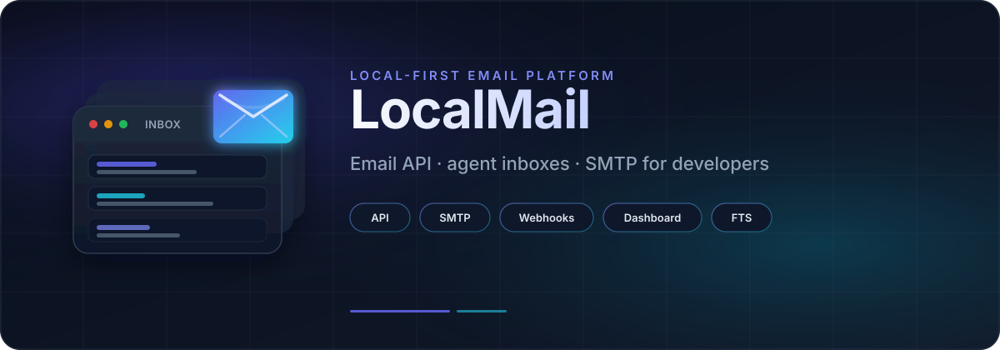
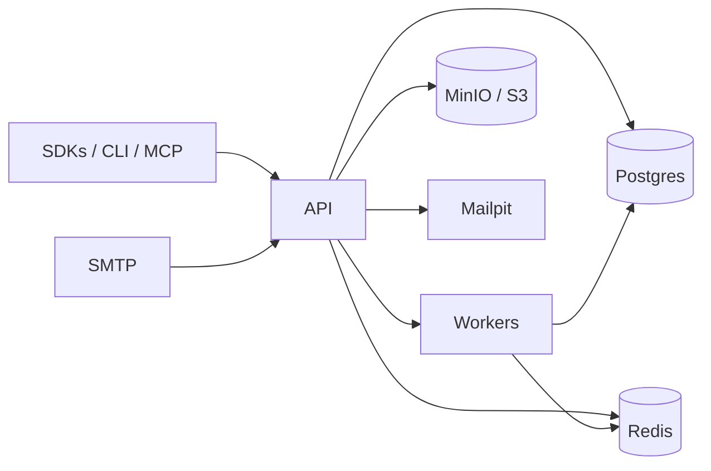

# LocalMail

<p align="center">
  
</p>

<p align="center">
  <a href="#license"></a>
  <a href="#quickstart-local"></a>
  <a href="docker-compose.yml"></a>
  
</p>

<p align="center"><strong>A local-first email inbox API, built for AI agents.</strong></p>

LocalMail gives every agent its own real inbox — create it with one API call, send from it, receive into it, and react to what arrives — through a REST API, TypeScript/Python SDKs, a CLI, WebSockets, webhooks, and an MCP server. It runs entirely on your own machine (or your own Docker host) via Docker Compose: no real domain, no DNS, no public internet required to develop against.



---

## What it is / who it's for

Most email platforms are built for humans reading a webmail client. LocalMail flips that: **agents are the primary users.** A coding agent that needs to sign up for a test service and grab an OTP, a support-triage agent that needs a real inbox to watch, two agents negotiating over email, a browser agent waiting on a confirmation link — LocalMail gives all of them a real, addressable mailbox with a clean API instead of a scraped Gmail account.

It's a good fit if you're building or testing agents that need to *own* an email address, not just read one. It is **not** a general-purpose webmail replacement or a production mail relay — the included dashboard is for debugging/admin, and public deliverability (real MX/SPF/DKIM/DMARC) is opt-in, not the default.

---

## Features

- **Inboxes** — create/list/get/update/delete, auto-generated or custom addresses, JSON metadata, idempotent creation
- **Full two-way email** — send, receive, reply, forward, with correct `In-Reply-To`/`References` threading and inbox-to-inbox loopback (no outbound relay needed when both sides are local)
- **Inbound SMTP** — a real local SMTP server for receiving mail, with attachment storage and reply-quote stripping
- **Real-time delivery** — signed webhooks (HMAC-SHA256, retries with backoff, delivery log) *and* a WebSocket stream, both fed by the same event pipeline
- **Drafts + scheduled send** — create/update drafts, send later at a given time
- **Multi-tenancy** — pods (isolated tenants) with scoped API keys and per-key/per-pod rate limiting
- **Search** — full-text search (Postgres `tsvector`) and optional semantic search (pgvector + local embeddings, no external embedding API required)
- **Custom domains** — add a domain, get the DNS records you'd need, verify it, and sign outbound mail with DKIM
- **Smart inbox (optional)** — Jev-based classification (spam/category/urgent/needs-human/auto-reply detection) with a deterministic keyword/header fallback when it's disabled
- **Agent tooling** — a TypeScript SDK, a Python SDK, a CLI, and an MCP server exposing inbox tools directly to Claude Code / Codex / other MCP-aware agents
- **Admin dashboard** — a Next.js app for browsing pods, inboxes, threads, webhook delivery logs, and search — for debugging, not for production email triage

---

## Architecture at a glance

A pnpm + Turborepo monorepo. Each service is a small, focused app; shared logic lives in packages so the apps stay thin.

**Services (`apps/`)**

| App | Role |
|---|---|
| `api` | Fastify REST API + WebSocket endpoint (`/v1/*`, `/v1/ws`) |
| `workers` | BullMQ workers — webhook delivery, Jev classification, embedding generation, scheduled send |
| `smtp` | Inbound SMTP server (mail lands here, gets parsed, threaded, and stored) |
| `dashboard` | Next.js admin/debug UI |
| `mcp` | MCP server (stdio) exposing LocalMail as tools to coding/browser agents |

**Packages (`packages/`)**

| Package | Role |
|---|---|
| `core` | Domain logic — threading, MIME building, hop-count guard, encryption helpers. Deliberately infra-free: no DB client, no queue library. |
| `db` | Drizzle ORM schema, migrations, and the typed Postgres client |
| `config` | Zod-validated environment loader shared by every app |
| `events` | Durable event publisher — writes the `events` table and fans out to BullMQ (webhooks) and Redis pub/sub (WebSocket) from one call site |
| `jev` | Jev (TypeSafe) classification client, plus the rules-based fallback used when Jev is disabled or unavailable |
| `embeddings` | Local text-embedding generation for semantic search (deterministic fallback, or a real local ONNX model) |
| `sdk` | TypeScript client, generated from the committed OpenAPI spec plus hand-written helpers (`waitForEmail`, `subscribe`, `verifyWebhookSignature`, ...) |
| `sdk-python` | Python client (`httpx`-based), same surface as the TypeScript SDK |
| `cli` | The `localmail` command-line tool |

**Infrastructure:** PostgreSQL (with `pgvector` for semantic search), Redis (queues + pub/sub), MinIO (S3-compatible object storage for raw mail and attachments), and Mailpit (a local SMTP catcher so you can see outbound mail without touching the real internet).

---

## Quickstart (local)

Prerequisites: Node 20+, Docker Desktop (or another Docker Engine with Compose v2).

```bash
corepack enable        # ensures the pinned pnpm version is available
pnpm install
cp .env.example .env
docker compose up -d
pnpm db:migrate
pnpm db:seed
pnpm dev
```

That brings up:

| Service | Port |
|---|---|
| API | `8080` |
| Inbound SMTP | `2525` |
| Dashboard | `3000` |
| Mailpit UI | `8025` |
| MinIO console | `9001` |

The seed step is idempotent — it creates a local pod, a hashed admin API key from `ADMIN_API_KEY`, and a demo inbox.

---

## Quickstart (Railway)

Each service deploys from its own Dockerfile at the repo root — set the Railway service's **Dockerfile path** to the matching file:

| Service | Dockerfile |
|---|---|
| API | `Dockerfile.api` |
| Workers | `Dockerfile.workers` |
| SMTP | `Dockerfile.smtp` |
| Dashboard | `Dockerfile.dashboard` |

All four build on Node 22. Provision managed Postgres (with the `pgvector` extension available), Redis, and an S3-compatible bucket (or run MinIO yourself), then point the usual environment variables at them.

You do **not** need a real domain to run this: the API, dashboard, and Mailpit all work over their own HTTPS URLs, and `MAIL_DOMAIN=localmail.test` is enough for inbox-to-inbox mail and local testing — Mailpit stands in for outbound delivery. A real domain is only needed if you want LocalMail to send/receive mail on the public internet, which means configuring your own MX, SPF, and DKIM records for that domain — see the custom-domains feature above.

---

## Environment variables

All names are documented in [`.env.example`](.env.example) — copy it to `.env` and fill in real values there; **never commit `.env`.**

| Variable | Purpose |
|---|---|
| `NODE_ENV` | Runtime environment |
| `LOG_LEVEL` | Log verbosity (pino) |
| `DATABASE_URL` | Postgres connection string |
| `REDIS_URL` | Redis connection string (queues + pub/sub) |
| `S3_ENDPOINT` | S3-compatible endpoint (MinIO locally) |
| `S3_ACCESS_KEY` | S3/MinIO access key |
| `S3_SECRET_KEY` | S3/MinIO secret key |
| `S3_BUCKET` | Bucket for raw mail and attachments |
| `SMTP_INBOUND_PORT` | Port the inbound SMTP server listens on |
| `SMTP_OUTBOUND_HOST` | Outbound relay host (Mailpit locally) |
| `SMTP_OUTBOUND_PORT` | Outbound relay port |
| `SMTP_MAX_HOPS` | Safety cap on inbox-to-inbox loopback hops |
| `SCHEDULED_SEND_POLL_INTERVAL_MS` | How often the scheduled-send worker polls |
| `RATE_LIMIT_RPS` / `RATE_LIMIT_BURST` | Per-API-key rate limit |
| `RATE_LIMIT_POD_RPS` / `RATE_LIMIT_POD_BURST` | Per-pod rate limit |
| `MAIL_DOMAIN` | Default domain for auto-generated inbox addresses |
| `API_HOST` / `API_PORT` | API bind address and port |
| `ADMIN_API_KEY` | Seeded admin API key — rotate before any real deployment |
| `ATTACHMENT_SIGNING_KEY` | HMAC key for signed, expiring attachment download URLs |
| `APP_ENCRYPTION_KEY` | Encrypts webhook/DKIM secrets at rest (generate with `openssl rand -base64 32`) |
| `SENDER_BLOCK_MODE` | How blocked senders are handled (`drop` or `spam`-label) |
| `JEV_ENABLED` | Turn on Jev-based smart classification |
| `TYPESAFE_API_KEY` | Jev/TypeSafe API key — workers only, never exposed to clients |

**Optional — local semantic search:** set `EMBEDDINGS_USE_ONNX=true` to use a real local embedding model instead of the deterministic offline fallback. See [`packages/embeddings`](packages/embeddings) for the model and setup details.

Never invent or commit real values for any of these — `.env` is git-ignored for a reason.

---

## Live demo

*Valid as of 2026-09-23:*

| | |
|---|---|
| API | https://api-production-717c.up.railway.app |
| Dashboard | https://dashboard-production-9fad.up.railway.app |
| Mailpit | https://mailpit-production-4625.up.railway.app |
| Inbound SMTP | `roundhouse.proxy.rlwy.net:38181` (TCP) |

---

## Smoke test / E2E

```bash
# health
curl -s https://api-production-717c.up.railway.app/healthz

# authenticated request
curl -s https://api-production-717c.up.railway.app/v1/me \
  -H "Authorization: Bearer $ADMIN_API_KEY"

# create an inbox
curl -s -X POST https://api-production-717c.up.railway.app/v1/inboxes \
  -H "Authorization: Bearer $ADMIN_API_KEY" -H "Content-Type: application/json" \
  -d '{"username":"support-bot","display_name":"Support Bot"}'
```

Two LocalMail inboxes can email each other directly (loopback, no outbound relay involved), or send to any external address and watch it land in Mailpit.

For a full, copy-pasteable operator checklist against the live demo above (health → auth → create inboxes → send → search → dashboard login, ~15–30 min), see [`TESTING.md`](TESTING.md).

Run the full repo check locally with:

```bash
pnpm check   # typecheck + lint + test, every package
```

A parameterized load test lives under [`k6/`](k6) if you want to exercise the API at scale (defaults to 1,000 inboxes / 10,000 messages; scale it down for a quick local run — see `k6/README.md`).

---

## More

- **Examples** — [`examples/agent-to-agent`](examples/agent-to-agent) (two inboxes negotiating a meeting over email), [`examples/auto-reply-agent`](examples/auto-reply-agent) (a deterministic support/billing auto-responder), [`examples/otp-signup-agent`](examples/otp-signup-agent) (`waitForEmail` for a verification-code flow)
- **TypeScript SDK** — [`packages/sdk`](packages/sdk)
- **Python SDK** — [`packages/sdk-python`](packages/sdk-python)
- **CLI** — [`packages/cli`](packages/cli)
- **MCP server** — [`apps/mcp`](apps/mcp)

---

## License

MIT
